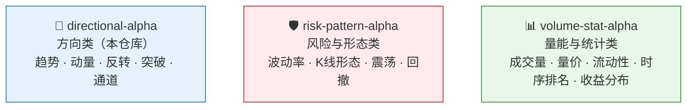
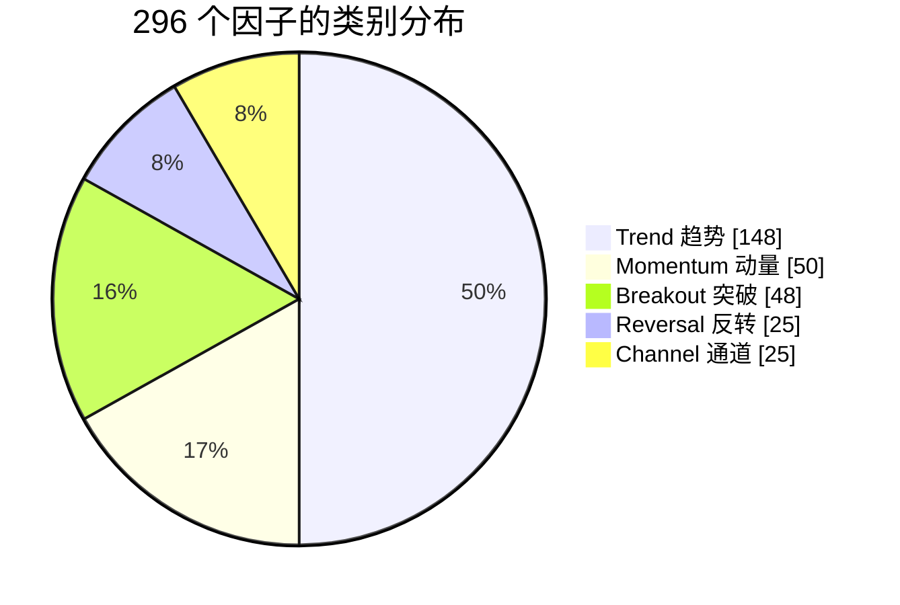
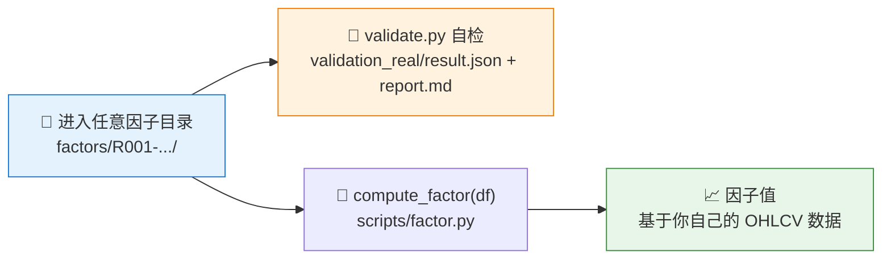

# 🧭 skill-quant-factor-directional-alpha

**简体中文** | [English](README.en.md)

> 方向类因子库：296 个独立 OHLCV 因子 Skill，真实行情验证 296/296 全部通过。

<p align="center">
  
  
  
  
  
  
</p>

`skill-quant-factor-directional-alpha` 是 QuantSkills 组织的方向类因子 Skill 仓库，收录用于刻画价格方向、趋势延续、突破、反转和通道位置的 OHLCV 因子。

QuantSkills GitHub 组织：https://github.com/quantskills

这个仓库适合用于研究：

- 趋势跟随
- 动量延续
- 均值反转
- 价格突破
- 区间位置和通道状态

## 🧭 QuantSkills 因子库导航

QuantSkills 将这批 OHLCV 因子按研究用途拆分为三个公开 Skill 仓库：



- [`skill-quant-factor-directional-alpha`](https://github.com/quantskills/skill-quant-factor-directional-alpha)：方向类，包含趋势、动量、反转、突破和通道位置因子。
- [`skill-quant-factor-risk-pattern-alpha`](https://github.com/quantskills/skill-quant-factor-risk-pattern-alpha)：风险与形态类，包含波动率、K 线形态、震荡和回撤因子。
- [`skill-quant-factor-volume-stat-alpha`](https://github.com/quantskills/skill-quant-factor-volume-stat-alpha)：量能与统计类，包含成交量、量价关系、流动性、时序排名和收益分布因子。

本仓库是其中的方向类因子库，不代表 QuantSkills 因子库的全部内容。

## 📦 仓库内容

本仓库包含 `296` 个因子 Skill，保留原始因子编号。



| 类别 | 数量 | 说明 |
|---|---:|---|
| Trend | 148 | 均线偏离、EMA 差、趋势强度、趋势效率等趋势状态 |
| Momentum | 50 | 收益动量、跳期动量等方向延续信号 |
| Reversal | 25 | 收益反转类信号 |
| Breakout | 48 | 上轨突破、下轨跌破等突破状态 |
| Channel | 25 | 区间位置、通道内相对位置 |

## 🗂️ 单个因子结构

每个因子都是一个独立 Skill 文件夹，统一放在 `factors/` 目录下，文件夹命名格式为 `<factor_id>-<english_slug>`：

```text
factors/
  R001-5d-z-scored-return-momentum/
    SKILL.md
    README.md
    scripts/
      factor.py
      validate.py
    validation_real/
      result.json
      report.md
    references/
      formula.md
    agents/
      openai.yaml
```

## 🗃️ 数据要求

因子代码只依赖标准 OHLCV 字段：

```text
date, symbol, open, high, low, close, volume
```

推荐额外保留：

```text
market
```

## 🧪 验证口径

本仓库因子已使用真实行情面板验证：

| 验证项 | 口径 |
|---|---|
| 🇨🇳 A股 | 98 个标的 |
| 🇺🇸 美股 | 50 个标的 |
| 📅 样本区间 | 2021-01-04 到 2026-06-10 |
| ✅ 验证结果 | 296 / 296 pass |

验证指标包括覆盖率、5 日 Rank IC、5 日 ICIR、五分组 Q5-Q1 收益差、Top 组换手率和无未来函数检查。

## 🚀 使用方式



进入任意因子目录后，可以直接运行自检：

```powershell
$env:PYTHONUTF8='1'
python .\scripts\validate.py
```

在代码中调用：

```python
from scripts.factor import compute_factor

result = compute_factor(df)
```

其中 `df` 是用户自己的 OHLCV 数据。

## 🗂️ 索引文件

| 文件 | 内容 |
|---|---|
| `factor_index.json` | 本仓库全部因子的元数据索引 |
| `validation_summary_real.json` | 本仓库全部因子的真实行情验证汇总 |
| `repo_summary.json` | 仓库级别统计信息 |

## 📜 License

This repository is licensed under the GNU General Public License v3.0. See [LICENSE](LICENSE).

Copyright (C) 2026 QuantSkills.
